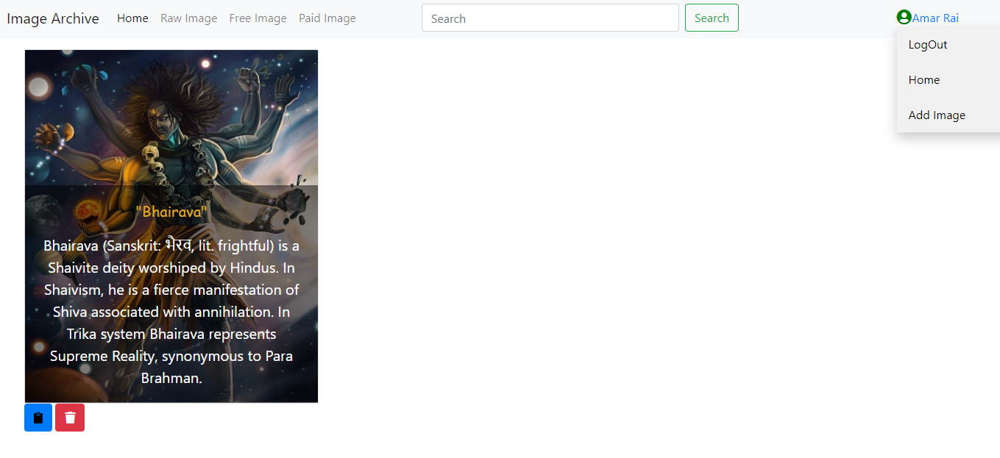
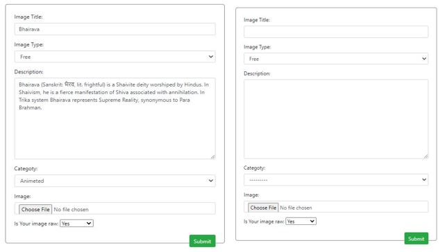

# Image Archive
Image Archive is django based web application where user can add new images, search Image, dowenload free to use image and delete unwanted images. 
## Key Features
1.	User can register themselves and log into the system
2.	User with valid username and password can log into the system 
3.	User can create a photo post in their list
4.	Photo post contains fields like :- Title, description, date, 
5.	All photos list should be listed down 
6.	Photos posted by the user to be listed with the edit and delete options 
7.	Click into one particular photos with the see more option to lead into showing all the photos uploaded by that user
8.	Use date attribute to list the posts photo with newest on in the first order
9.	Free to download and use option if the photo is free to use [option: Green button to download]
10.	Also show a different section in the Photographs list with attribute raw which can be Boolean field in the model fields
11. User can search for image based on image title

#Quick View

## Main Page
 

## Other Option in Main page
 

## Logged in users

## Add & Edit image

